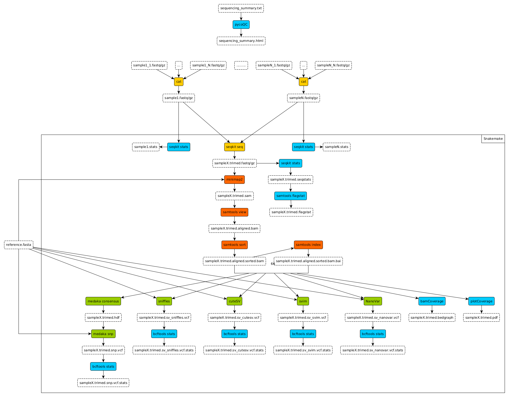

# BioInformatics Learning Lab - BILL


## Variant calling pipeline designed for teaching

The Bioinformatics Learning Lab (BILL) is a teaching unit of the Master of Bioinformatics of the University of Montpellier. Students take part in a research project analysing structural variants (SVs) and small nucleotide variants (SNVs).

They perform DNA extraction, sequencing, data analysis and interpretation of the results. 

This pipeline starts by trimming the read files by removing reads smaller than 1,000 bp. It then proceeds to align the reads against the virus genomic reference. It processes the alignment by removing unaligned reads and converting them to a sorted binary format. It then performs a variant calling step and filters the resulting variants. Finally, it merges all variant files into a _VCF_ file. Some statistical commands appear throughout the pipeline to check the quality of the data or results.



- [Getting Started](#getting-started)
    - [Dependencies](#dependencies)
    - [How to install it](#install)
    - [How to test it](#how-to-test-it)
    - [How to use it](#how-to-use-it)
- [Authors](#authors)
- [Acknowledgements](#acknowledgement)

## Getting Started

### Dependencies

- snakemake v7.20.0
- seqkit v2.3.0
- minimap2 v2.24-r1122
- samtools v1.11
- deeptools v3.5.1
- sniffles2 v2.0.7
- tabix v1.11
- bcftools v1.11

### How to install it

Clone the repository wherever you want on your local:

```
git clone git@gitlab.com:asfistonlavie/bill.git # by SSH 
git clone https://gitlab.com/asfistonlavie/bill.git # by HTTPS
```
Copy or move all your input data (reads and genomic references) to the `resources/` folder (respectively `resources/inputs/` and `resources/references`).
```
cp </path/to/your/reads/*.fastq> bill/resources/inputs/
cp </path/to/your/reads/*.fastq.gz> bill/resources/inputs/
cp </path/to/your/references/*.fasta> bill/resources/references/

```
### How to test it


### How to use it

There are three ways to use this pipeline: (1) by file name, (2) by file type, or (3) the whole pipeline. The main command to run all pipeline is `snakemake --cores <nb_core_max>`.

If you just want a specific file, run:
```
snakemake --cores <nb_core_max> <file_name>
```
It will automatically find the correct rule to run based on the file name. File names are constrained by the snakefile (see the [wiki](https://gitlab.com/souliera/bill/-/wikis/Release-2024/Rule-details) for correct file name format).

If you want all of a type of file, run :
```
snakemake --cores <nb_core_max> <file_type_name>
```
You can override each option in the configuration file- by adding the parameter `--config <option_name>=<option_value>` to the snakemake command.

## Authors

- Arnaud Soulier --> [Github profil](https://github.com/souliera)<br>
- Catherine Breton --> [Github profil](https://github.com/CathyBreton)<br>
- Anna-Sophie Fiston-Lavier --> [Github profil](https://github.com/asfistonlavie)

## Acknowledgement

[](https://informatique-fds.edu.umontpellier.fr/etudiants/masters-transdisciplinaires/master-bioinformatique/bill-bioinformatics-learning-lab/)


[](https://github.com/asfistonlavie/BILL/releases)
[](https://github.com/asfistonlavie/BILL/wiki)
