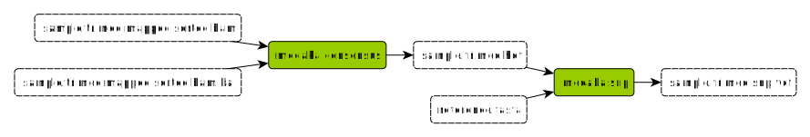
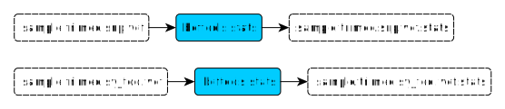

# Variant calling

## SNP calling

#### **medaka consensus**

- Input:
	- BAM file (mapped & sorted reads)  
&emsp;&rarr; provided by `samtools sort` [rule](mapping.md#samtools-sort)
	- BAI file (mapped & sorted index)  
&emsp;&rarr; provided by `samtools index` [rule](mapping.md#samtools-index)
- Output:
	- HDF file (??)  
&emsp;&rarr; used by `medaka snp` [rule](#medaka-snp)
- Description:  
&emsp; ??

#### **medaka snp**

- Input:
	- HDF file (??)  
&emsp;&rarr; provided by `medaka consensus` [rule](#medaka-consensus)
	- Fasta file (reference)  
- Output:
	- VCF file (SNP)  
&emsp;&rarr; used by `bcftools stats` [rule](#bcftools stats)
- Description:  
&emsp; Call all the SNP between the sample and the reference

## SV calling

#### **sniffles**

- Input:
	- BAM file (mapped & sorted reads)  
&emsp;&rarr; provided by `samtools sort` [rule](#samtools-sort)
	- BAI file (mapped & sorted index)  
&emsp;&rarr; provided by `samtools index` [rule](#samtools-index)
	- FASTA file (reference)  
- Output:
	- VCF file (SV)  
&emsp;&rarr; used by `bcftools stats` [rule](#bcftools-stats)
- Description:  
&emsp; Call all the SV between the sample and the reference with Sniffles tool

#### **cuteSV**

- Input:
	- BAM file (mapped & sorted reads)  
&emsp;&rarr; provided by `samtools sort` [rule](#samtools-sort)
	- BAI file (mapped & sorted index)  
&emsp;&rarr; provided by `samtools index` [rule](#samtools-index)
	- FASTA file (reference)  
- Output:
	- VCF file (SV)  
&emsp;&rarr; used by `bcftools stats` [rule](#bcftools-stats)
- Description:  
&emsp; Call all the SV between the sample and the reference with cuteSV tool

#### **svim**

- Input:
	- BAM file (mapped & sorted reads)  
&emsp;&rarr; provided by `samtools sort` [rule](#samtools-sort)
	- BAI file (mapped & sorted index)  
&emsp;&rarr; provided by `samtools index` [rule](#samtools-index)
	- FASTA file (reference)  
- Output:
	- VCF file (SV)  
&emsp;&rarr; used by `bcftools stats` [rule](#bcftools-stats)
- Description:  
&emsp; Call all the SV between the sample and the reference with svim tool

#### **NanoVar**

- Input:
	- BAM file (mapped & sorted reads)  
&emsp;&rarr; provided by `samtools sort` [rule](#samtools-sort)
	- BAI file (mapped & sorted index)  
&emsp;&rarr; provided by `samtools index` [rule](#samtools-index)
	- FASTA file (reference)  
- Output:
	- VCF file (SV)  
&emsp;&rarr; used by `bcftools stats` [rule](#bcftools-stats)
- Description:  
&emsp; Call all the SV between the sample and the reference with NanoVar tool

## Statistic control

#### **bcftools stats**

- Input:
	- VCF file (SNP or SV)  
&emsp;&rarr; provided by `medaka snp` [rule](#medaka-snp)  
&emsp;&rarr; provided by `sniffles` [rule](#sniffles)  
&emsp;&rarr; provided by `cuteSV` [rule](#cutesv)  
&emsp;&rarr; provided by `svim` [rule](#svim)  
&emsp;&rarr; provided by `NanoVar` [rule](#nonavar)  
- Output:
	- TXT file (VCF stats)
- Description:  
&emsp; Compute stats of the variant
