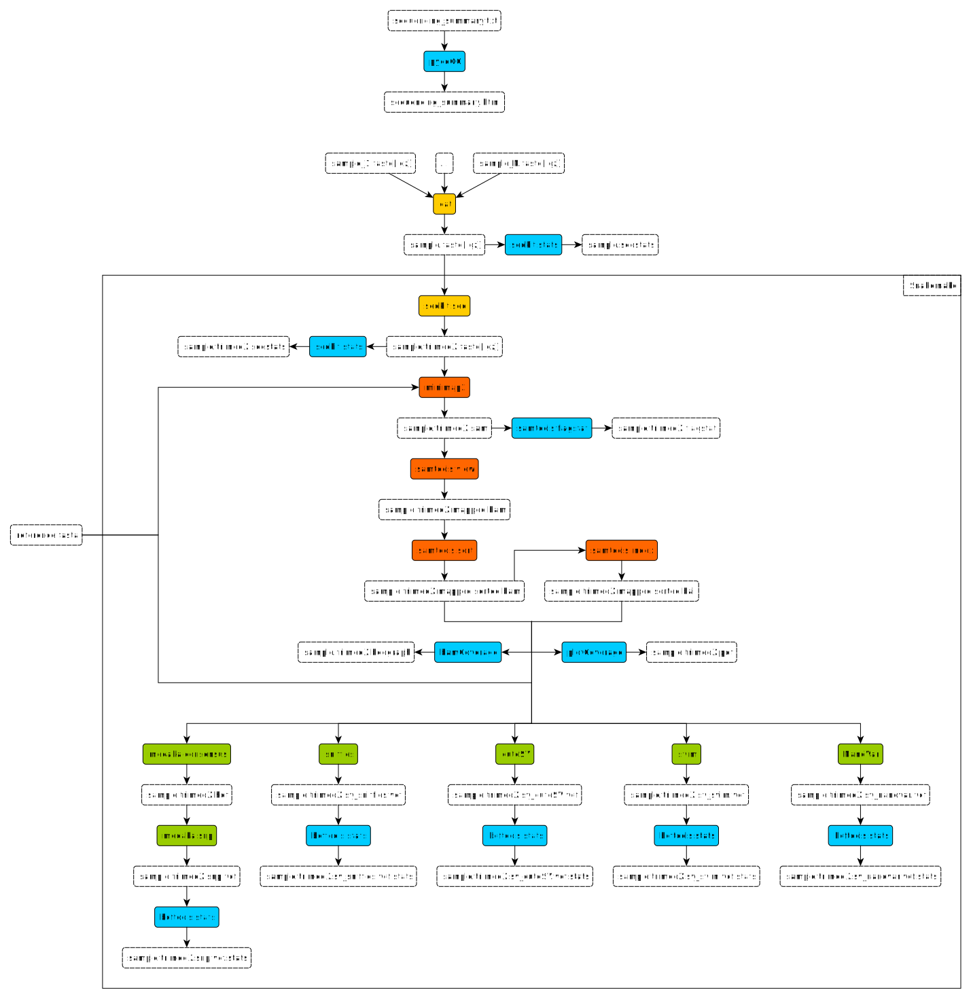

# Home
 
This pipeline starts by trimming the read files by removing reads smaller than 1,000 bp. It then proceeds to align the reads against the virus genomic reference. It processes the alignment by removing unaligned reads and converting them to a sorted binary format. Finally, it performs a variant calling step and filters the resulting variants. Some statistical commands appear throughout the pipeline to check the quality of the data or results.



## Usage

### Install

Clone the repository wherever you want on your local:

```
git clone git@gitlab.com:asfistonlavie/bill.git # by SSH
git clone https://gitlab.com/asfistonlavie/bill.git # by HTTPS
```

### Run

To run this Snakemake pipeline, you must be in the `workflow` folder or its parent folder.

There are two ways to run this pipeline on a cluster (e.g NGSTC):

- with the srun command (`srun snakemake --cores <nb_core_max> --configfile workflow/config/config.yaml [options] <target>`),
- or with a cluster config (`snakemake --profile workflow/ngstc --configfile workflow/config/config.yaml [options] <target>`).

There are three possible types to use in target field:

- (1) a file path,
- (2) a rule name that matches a file extension, 
- or (3) the whole pipeline.

If you just want a specific file (1), run: 
```
srun snakemake --cores <nb_core_max> --configfile workflow/config/config.yaml [options] <path/to/file>
# OR
snakemake --profile workflow/ngstc --configfile workflow/config/config.yaml [options] <path/to/file>
```
It will automatically find the correct rule to run based on the file path. File names are constrained by the snakefile (see the doc for correct file name format).

If you want all of a type of file (2), run :
```
srun snakemake --cores <nb_core_max> --configfile workflow/config/config.yaml [options] <rule_name>
# OR
snakemake --profile workflow/ngstc --configfile workflow/config/config.yaml [options] <rule_name>
```
It will automatically run this rule and all dependencies for all samples defined in config file (run snakemake --help for the list of available rule names).

If you want to run the whole pipeline (3), run:
```
srun snakemake --cores <nb_core_max> --configfile workflow/config/config.yaml [options] all
# OR
snakemake --profile workflow/ngstc --configfile workflow/config/config.yaml [options] all
```
