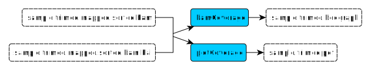

# Read mapping

<!-- resulmé -->

## **Mapping**

#### **minimap2**

- Input:
	- Fastq || fastq.gz file (trimed reads)  
&emsp;&rarr; provided by `seqkit seq` [rule](preprocessing.md#seqkit-seq)
	- Fasta file (reference)
- Output:
	- SAM file (mapping)  
&emsp;&rarr; used by `samtools view` [rule](#samtools-view)  
&emsp;&rarr; used by `samtools flagstat` [rule](#samtools-flagstat)
- Description:  
&emsp;Mapped the reads on the reference provided.
- Default options:
	- `--MD` &rarr; output the MD tag
	- `-a` &rarr; choose SAM as output format
	- `-x map-ont` &rarr; choose Nanopore vs reference mapping

#### **samtools view**

- Input:
	- SAM file (mapping)  
&emsp;&rarr; provided by `minimap2` [rule](#minimap2)
- Output:
	- BAM file (mapped reads)  
&emsp;&rarr; used by `samtools sort` [rule](#samtools-sort)
- Description:  
&emsp;Convert the mapping file in binary format et remove unmapped reads
- Default options:
	- `-b` &rarr; convert output in BAM format
	- `-h` &rarr; include header
	- `-S` &rarr; input format is auto-detected
	- `-F 4` &rarr; exclude flags 4 (unmapped reads)

#### **samtools sort**

- Input:
	- BAM file (mapped reads)  
&emsp;&rarr; provided by `samtools view` [rule](#samtools-view)
- Output:
	- BAM file (mapped & sorted reads)  
&emsp;&rarr; used by `samtools index` [rule](#samtools-index)  
&emsp;&rarr; used by `medaka consensus` [rule](calling.md#medaka-consensus)  
&emsp;&rarr; used by `sniffles` [rule](calling.md#sniffles)  
&emsp;&rarr; used by `cuteSV` [rule](calling.md#cutesv)  
&emsp;&rarr; used by `svim` [rule](calling.md#svim)  
&emsp;&rarr; used by `NanoVar` [rule](calling.md#nanovar)  
&emsp;&rarr; used by `bamCoverage` [rule](#bamcoverage)  
&emsp;&rarr; used by `plotCoverage` [rule](#plotcoverage)  
- Description:  
&emsp;Sort mapped reads
- Default options:
	- `-l 9` &rarr; set compression to best level

## Indexing

#### **samtools index**

- Input:
	- BAM file (mapped & sorted reads)  
&emsp;&rarr; provided by `samtools sort` [rule](#samtools-sort)
- Output:
	- BAI file (mapped & sorted index)  
&emsp;&rarr; used by `medaka consensus` [rule](calling.md#medaka-consensus)  
&emsp;&rarr; used by `sniffles` [rule](calling.md#sniffles)  
&emsp;&rarr; used by `cuteSV` [rule](calling.md#cutesv)  
&emsp;&rarr; used by `svim` [rule](calling.md#svim)  
&emsp;&rarr; used by `NanoVar` [rule](calling.md#nanovar)  
&emsp;&rarr; used by `bamCoverage` [rule](#bamcoverage)  
&emsp;&rarr; used by `plotCoverage` [rule](#plotcoverage)  
- Description:  
&emsp;Create a index of the mapped & sorted BAM file

## Statistic control

#### **samtools flagstat**

- Input:
	- SAM file (mapping)  
&emsp;&rarr; provided by `minimap2` [rule](#minimap2)
- Output:
	- flagstat file  
- Description:  
&emsp;Compute the mapping statistics

#### **bamCoverage**

- Input:
	- BAM file (mapped & sorted reads)  
&emsp;&rarr; provided by `samtools sort` [rule](#samtools-sort)
	- BAI file (mapped & sorted index)  
&emsp;&rarr; provided by `samtools index` [rule](#samtools-index)
- Output:
	- bedgraph file (coverage file)  
- Description:  
&emsp;Compute the bedgraph of the sample mapping
- Default options:
	- `--normalizeUsing RPGC` &rarr; Choose the RPGC method to normalize number of reads per bin
	- `-of bedgraph` &rarr; Choose bedgraph as output file type

#### **plotCoverage**

- Input:
	- BAM file (mapped & sorted reads)  
&emsp;&rarr; provided by `samtools sort` [rule](#samtools-sort)
	- BAI file (mapped & sorted index)  
&emsp;&rarr; provided by `samtools index` [rule](#samtools-index)
- Output:
	- PDF file (depth plot)  
- Description:  
&emsp;Create the plot of the coverage for the sample mapping.
- Default options:
	- `--smartLabels` &rarr; use file name as labels
	- `--plotFileFormat pdf` &rarr; choose pdf as output format
